# Wazuh SIEM Security Lab

A Security Information and Event Management (SIEM) lab built using **Wazuh**, **Sysmon**, and **Windows 11** for centralized log collection, endpoint monitoring, threat detection, and vulnerability assessment.

---

## Project Overview

This project demonstrates the deployment of a Wazuh SIEM environment capable of:

- Collecting Windows endpoint logs
- Monitoring system activity using Sysmon
- Detecting security events
- Performing vulnerability assessment
- Centralizing logs through the Wazuh Dashboard

---

## Lab Architecture

```
Windows 11 Endpoint
       │
       │ Sysmon Logs
       ▼
Wazuh Agent
       │
       ▼
Wazuh Manager
       │
       ▼
Wazuh Indexer
       │
       ▼
Wazuh Dashboard
```

---

## Technologies Used

- Wazuh
- Sysmon
- Windows 11
- Ubuntu Server
- Linux
- PowerShell

---

## Features

- SIEM Deployment
- Windows Endpoint Monitoring
- Sysmon Integration
- Log Collection
- Threat Detection
- Vulnerability Detection
- Security Dashboard
- Agent Monitoring

---

# Project Screenshots

## 1. Wazuh Dashboard (Before Agent Registration)

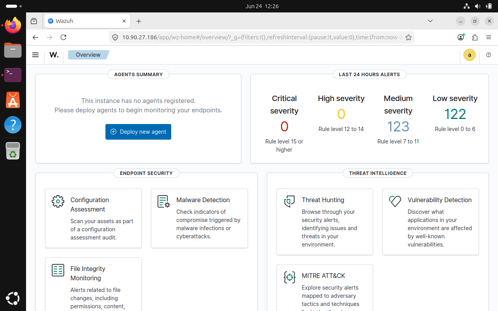

---

## 2. Wazuh Manager Running

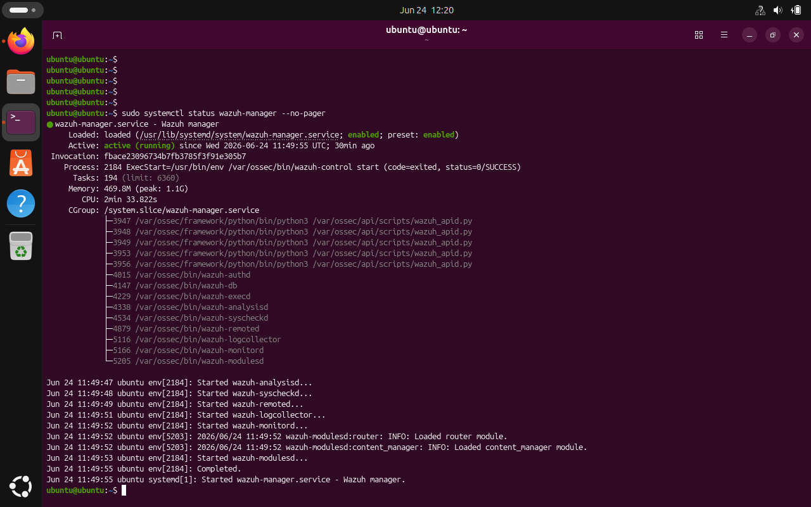

---

## 3. Wazuh Indexer Running

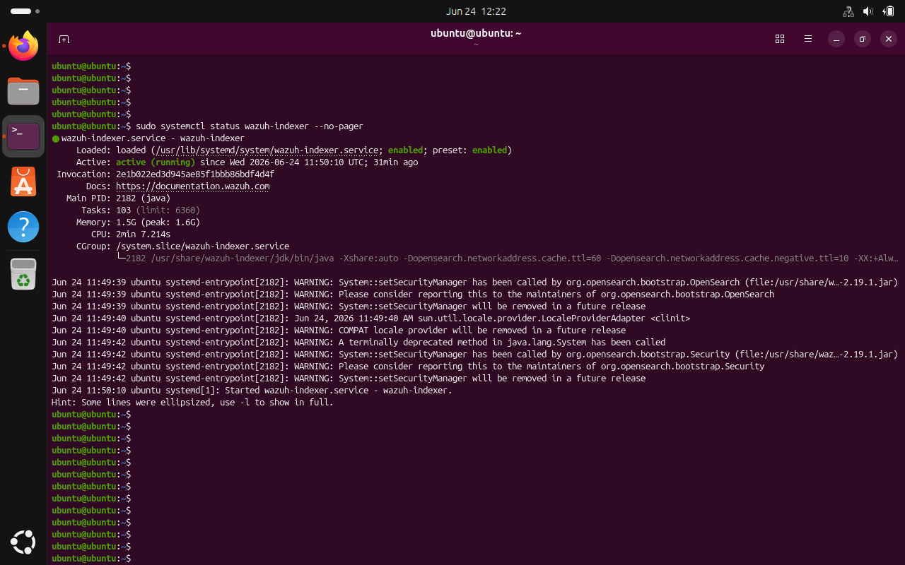

---

## 4. Wazuh Dashboard Service Running

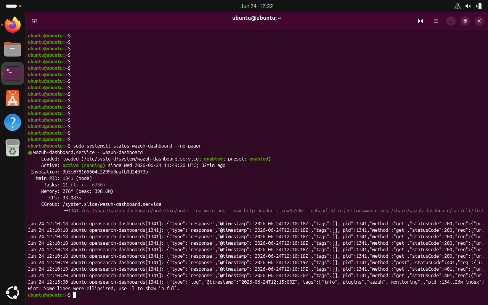

---

## 5. Active Wazuh Agent

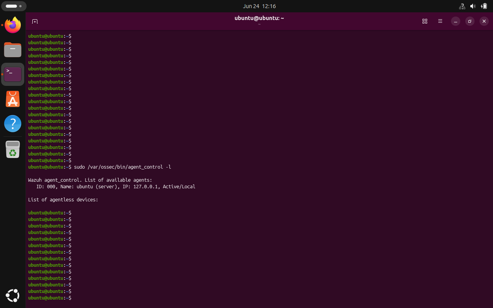

---

## 6. Sysmon Installed

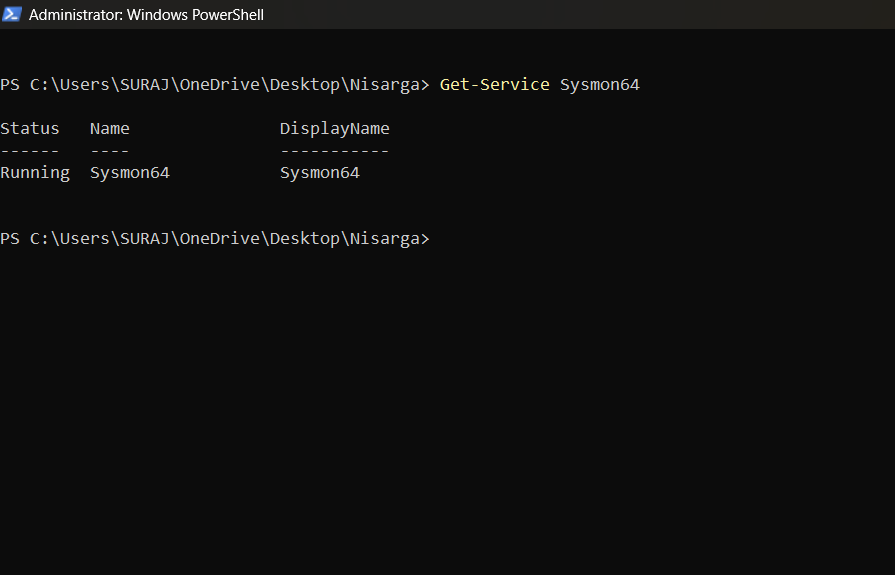

---

## 7. Sysmon Event Logs

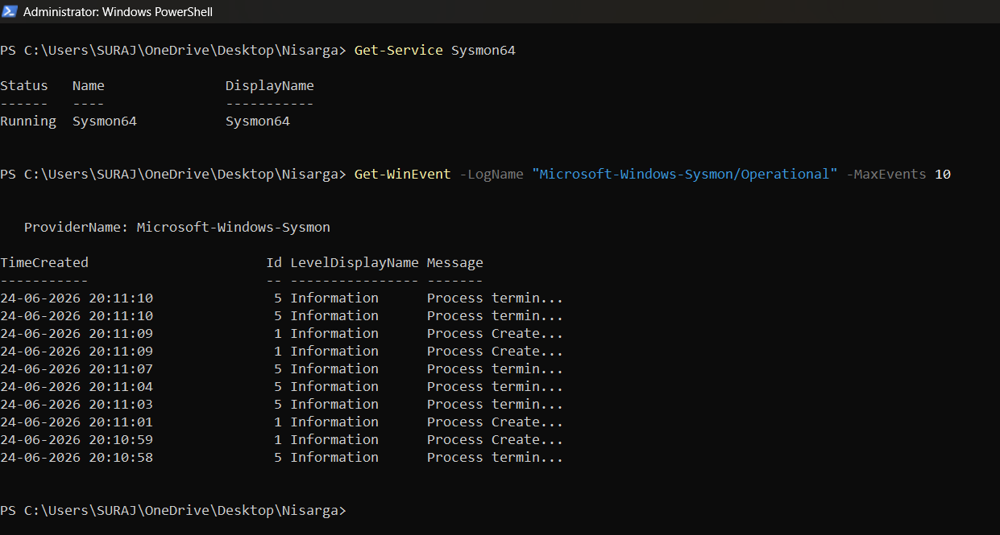

---

## 8. Wazuh Agent Service

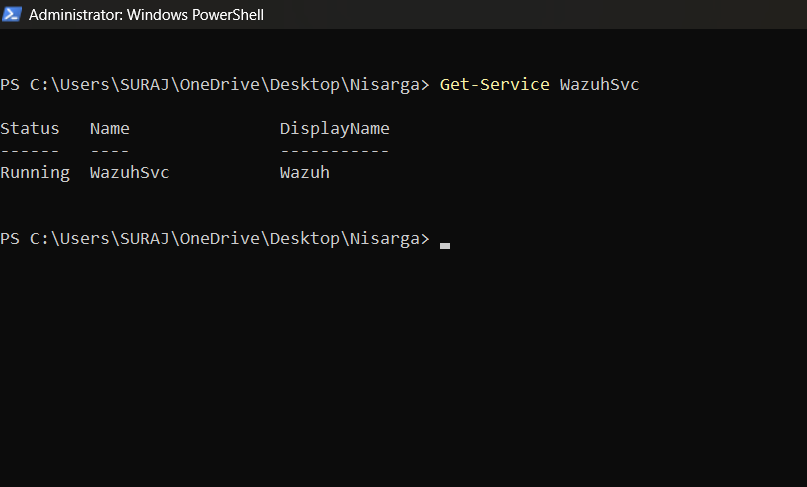

---

## 9. Agent Security Overview

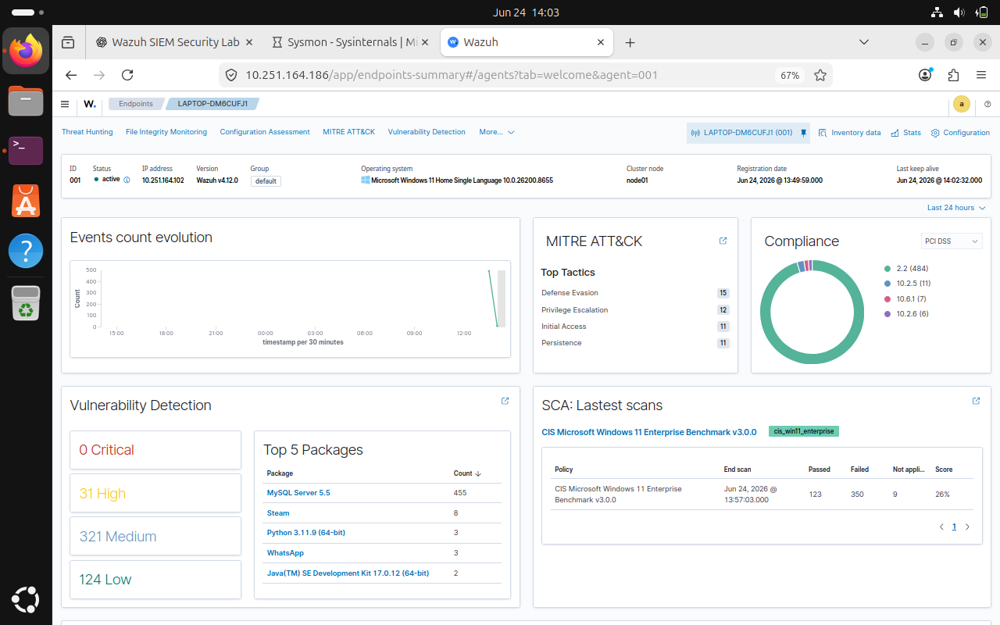

---

## 10. Vulnerability Detection Overview

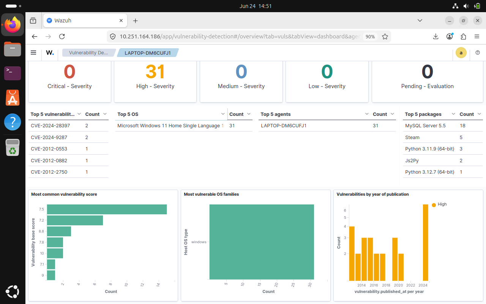

---

## 11. High Severity Vulnerabilities

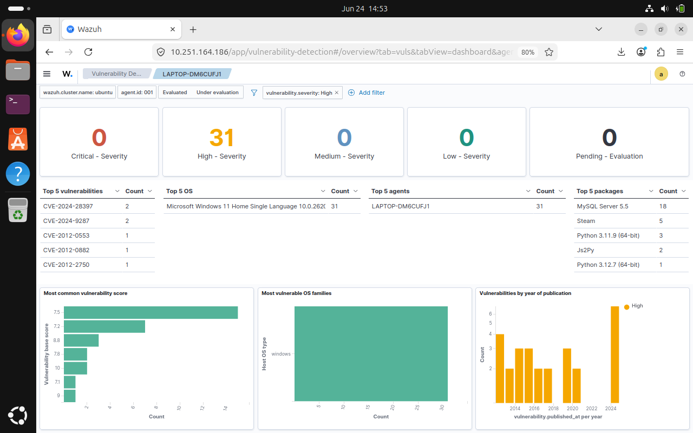

---

## 12. Medium Severity Vulnerabilities

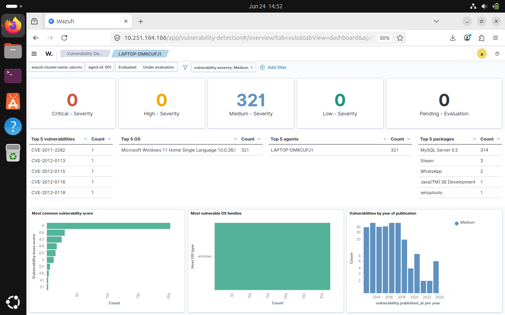

---

## 13. Low Severity Vulnerabilities

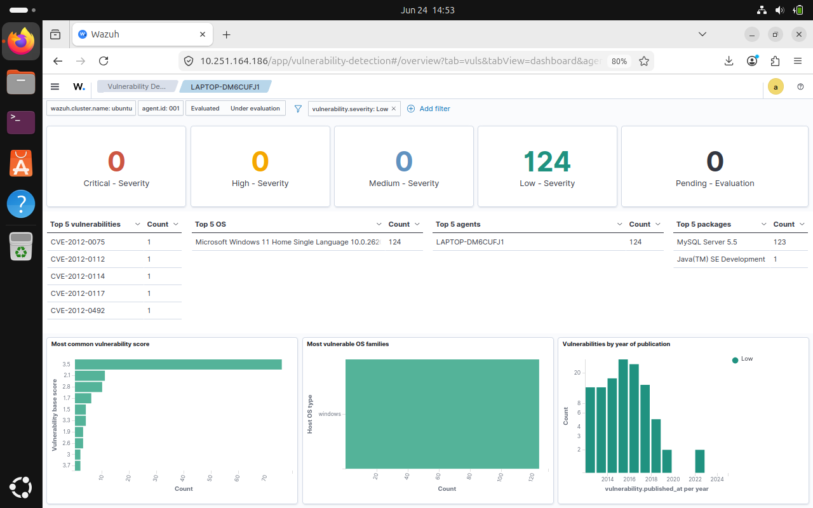

---

# Verification Commands

See **Commands.md** for all commands used during setup and verification.

---

# Learning Outcomes

Through this project I learned:

- SIEM deployment
- Wazuh architecture
- Windows endpoint monitoring
- Sysmon configuration
- Log analysis
- Threat detection
- Vulnerability assessment
- Linux service management

---

# Repository Structure

```
Wazuh-SIEM-Security-Lab
│
├── README.md
├── Commands.md
├── LICENSE
└── Screenshots
    ├── 01-wazuh-dashboard-home-before-agent.png
    ├── 02-wazuh-manager-service-running.png
    ├── 03-wazuh-indexer-service-running.png
    ├── 04-wazuh-dashboard-service-running.png
    ├── 05-wazuh-active-agents-dashboard.png
    ├── 06-sysmon-service-installed.png
    ├── 07-sysmon-event-logs-generated.png
    ├── 08-wazuh-agent-service-running.png
    ├── 09-agent-security-overview-dashboard.png
    ├── 10-vulnerability-detection-overview.png
    ├── 11-high-severity-vulnerabilities.png
    ├── 12-medium-severity-vulnerabilities.png
    └── 13-low-severity-vulnerabilities.png
```

---


**Nisarga N T**

Cybersecurity Student | SIEM | Blue Team | SOC Analyst
